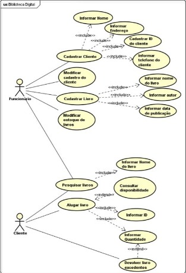

# Documentação do projeto

## Integrantes do grupo

Bruno Freitas Brandão, Gabriel Henrique Vieira Timóteo, Gustavo Prado Bezerra de Araujo, Enzo Gabriel Artegiani

## Visão do Produto

O projeto "Biblioteca Para Todos" visa desenvolver um sistema básico para gerenciamento de bibliotecas públicas ou acadêmicas utilizando a linguagem de programação C. O sistema permitirá o cadastro, consulta e gerenciamento de livros e usuários, facilitando a administração de uma pequena biblioteca acadêmica.

## Frase de elevador (Biblioteca para Todos)

Para bibliotecas públicas ou acadêmicas que precisam de uma solução eficiente para gerenciar seus acervos, o Biblioteca Para Todos é um sistema desenvolvido em C que permite o cadastro, consulta e gerenciamento de livros e usuários, além de facilitar o controle de empréstimos e devoluções. Diferente de outros sistemas de gestão de bibliotecas, o Biblioteca Para Todos oferece uma interface simples e intuitiva, além de ser gratuito, proporcionando uma administração mais organizada e produtiva.

## Product Backlog

[Product Backlog - Biblioteca para Todos](arquivos/product_backlog.xlsx)

## Diagrama de casos de uso

## Descrição de Fluxos de Eventos

### Nome: Empréstimo de Livro

### Fluxo de Eventos Normal

O cliente insere seu ID.

O programa analisa o ID e verifica se ele é aceitável.

O programa solicita os nomes dos livros.

O cliente informa o nome do livro.

O programa analisa o nome do livro e verifica se ele é aceitável.

O programa solicita a quantidades de livros que o cliente deseja.

O cliente informa a quantidade de livros que ele deseja fazer o empréstimo.

O programa analisa a quantidade de livros e verifica se ele é aceitável.

O cliente seleciona a opção empréstimo de livro.

O programa realiza uma requisição para que os livros escolhidos sejam enviados para o cliente.

Os livros são liberados para o cliente.

### Fluxo de Eventos de Exceção

2a – O ID não é aceitável: Seja porque os caracteres informados são incompatíveis ou aquele ID não foi cadastrado, será envia uma mensagem de erro, com a mensagem “ID incorreto” ou “ID não cadastrado”, e retorna ao passo 1.

5a – O nome não é aceitável: Se o nome informado esteja incorreto, será enviado a mensagem “Livro não encontrado”, e retorna ao passo 4.

8a – A quantidade não é aceitável: Se a quantidade de livros passar do limite, será enviado uma mensagem “Quantidade excedida”, o cliente retorna ao passo 7 e reduz a quantidade de livros.

10a – Empréstimo não autorizado: Uma mensagem de erro é enviada ao cliente, “erro ao realizar empréstimo”, e retorna à opção 9.

1 a 9 – Cancelamento: O cliente pode cancelar o empréstimo dos livros, enquanto o empréstimo não for autorizado pelo programa.

### Nome: Devolver Livro

### Fluxo de Eventos Normal

O cliente insere seu ID.

O programa analisa o ID e verifica se ele é aceitável.

O cliente informa a quantidade de livros que ele deseja devolver.

O programa analisa se quantidade de livros a serem devolvidos e verifica se ele é aceitável.

O programa solicita os IDs dos livros a serem devolvidos.

O cliente informa os IDs dos livros.

O programa analisa os IDs dos livros e verifica se eles são aceitáveis.

O cliente seleciona a opção devolver livros.

O programa realiza uma requisição para que os livros que o cliente deseja devolver sejam enviados de volta para a biblioteca.

Os livros são liberados para devolução.

### Fluxo de Eventos de Exceção

2a – O ID do cliente não é aceitável: Seja porque os caracteres informados são incompatíveis ou aquele ID não foi cadastrado, será envia uma mensagem de erro, com a mensagem “ID incorreto” ou “ID não cadastrado”, e retorna ao passo 1.

4a – A quantidade não é aceitável: Se a quantidade de livros passar do limite, será enviado uma mensagem “Quantidade excedida”, o cliente retorna ao passo 3 e reduz a quantidade de livros.

7a – O ID do livro não é aceitável: Seja porque os caracteres informados são incompatíveis ou aquele ID não foi cadastrado, será envia uma mensagem de erro, com a mensagem “ID do livro incorreto” ou “ID do livro não cadastrado”, e retorna ao passo 6.

9a – Devolução não autorizado: Uma mensagem de erro é enviada ao cliente, “erro ao realizar Devolução”, e retorna à opção 8.

1 a 8 – Cancelamento: O cliente pode cancelar a devolução dos livros, enquanto a devolução não for autorizado pelo programa.

## Diagrama de atividades

[Diagrama de Atividades](arquivos/diagrama_atividades.pdf)

## Guia do Usuário

Para criar um guia do usuário eficaz para um software de biblioteca digital, você pode seguir esta estrutura básica:

---

### Guia do Usuário: Software da Biblioteca Digital

Bem-vindo ao software da Biblioteca Digital! Este guia foi criado para ajudá-lo a aproveitar ao máximo nossa plataforma, facilitando o acesso a uma vasta gama de recursos educacionais e culturais. Siga os passos abaixo para começar:

#### 1. *Login e Navegação Inicial*

- *Login:* Utilize suas credenciais fornecidas para acessar a plataforma. Caso seja seu primeiro acesso, siga as instruções para criar uma conta.

- *Painel Principal:* Após o login, você será direcionado ao painel principal. Aqui você encontrará:

  - *Pesquisa:* Use a barra de pesquisa para encontrar livros, artigos, periódicos e outros materiais disponíveis na biblioteca digital.
  
  - *Categorias:* Explore os recursos por categorias como literatura, ciências, história, etc.
  
  - *Destaques:* Veja recomendações de materiais populares ou novidades adicionadas recentemente.

#### 2. *Pesquisa e Descoberta de Conteúdo*

- *Busca Avançada:* Para uma pesquisa mais detalhada, utilize filtros como autor, título, ano de publicação, etc.
  
- *Resultados da Pesquisa:* Clique nos resultados para visualizar detalhes do item, incluindo uma descrição, disponibilidade e opções de leitura ou download.

#### 3. *Leitura e Acesso aos Recursos*

- *Visualização Online:* Para visualizar um livro ou artigo online, clique no botão "Visualizar". Use as ferramentas de zoom e navegação para explorar o conteúdo.
  
- *Download:* Para baixar um recurso, escolha o formato desejado (PDF, ePub, etc.) e clique em "Download". Siga as instruções para concluir o processo de download.

#### 4. *Gerenciamento de Conta e Configurações*

- *Perfil de Usuário:* Acesse seu perfil para atualizar suas informações pessoais, preferências de comunicação e senha.
  
- *Histórico de Empréstimos:* Visualize os materiais que você tem emprestados e suas datas de devolução.

---

Este guia do usuário deve ser claro, conciso e fácil de seguir, garantindo uma experiência agradável e produtiva ao utilizar o software da sua biblioteca digital.